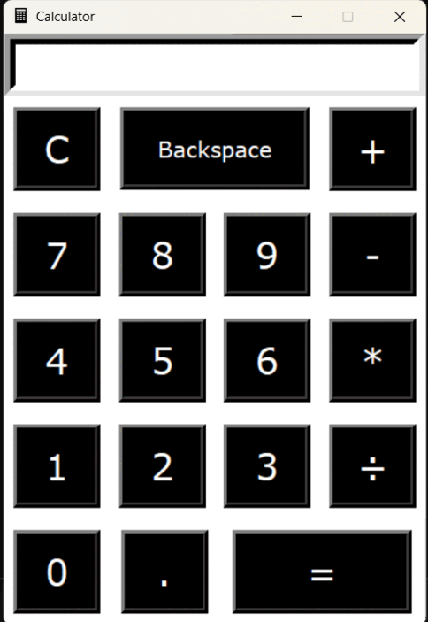

# 🧮 Simple Calculator – Python Tkinter GUI

A modern GUI calculator built using **Python** and **Tkinter**. This basic calculator handles arithmetic operations with a clean and user-friendly interface.

---
## 🛠 Features

- Basic arithmetic operations: `+`, `-`, `*`, `÷`
- Special functions: `Clear`, `Backspace`, `Decimal`
- Interactive display area
- Responsive and intuitive button layout
- Custom-styled dark UI buttons for clarity and contrast

---

## 🎥 Demo (GIF)

